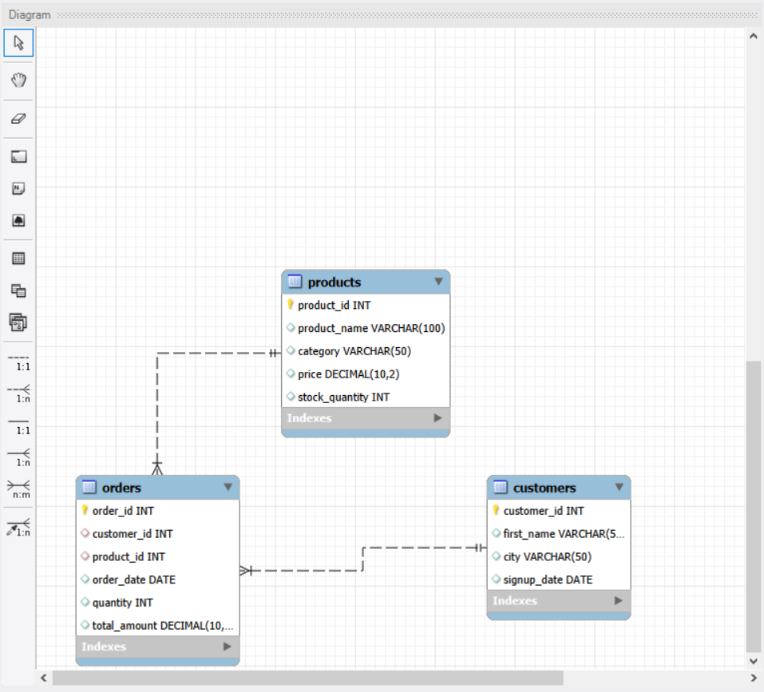
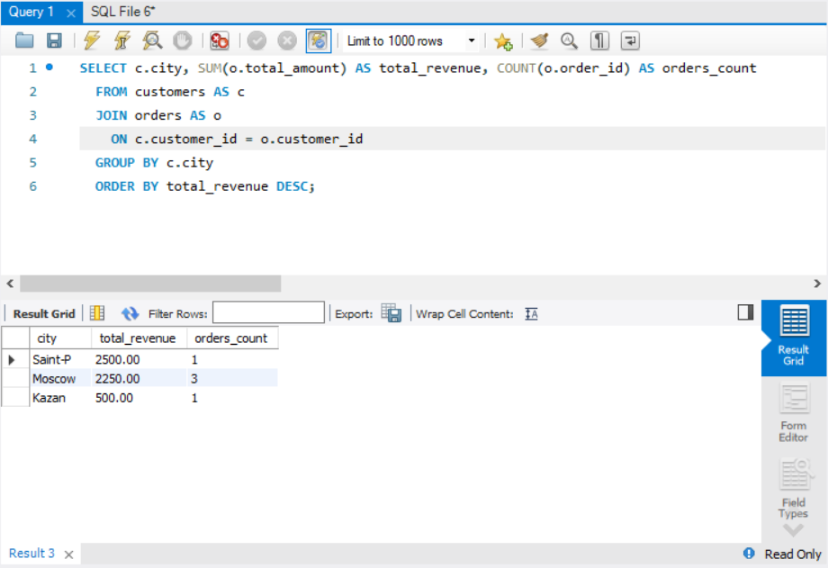

# Retail Sales Data Analytics Project (SQL)

## Описание проекта
В данном проекте я реализовал полный цикл работы с данными для E-commerce платформы: от проектирования схемы базы данных до написания сложных аналитических отчетов.

## Технологии
* **БД:** MySQL
* **Инструментарий:** MySQL Workbench
* **SQL Skills:** DDL (создание таблиц), DML (наполнение данными), Joins (Inner, Left), Агрегатные функции (SUM, AVG), Группировки (GROUP BY).

## Структура базы данных
Для проекта была спроектирована схема, включающая таблицы клиентов, товаров и заказов с настроенными связями (Foreign Keys).

## Ключевые отчеты
1. **Анализ выручки по городам:** Позволил определить наиболее прибыльные регионы.
2. **Эффективность товаров:** Выявлены лидеры продаж по сумме выручки.
3. **Анализ неликвидных товаров:** С помощью `LEFT JOIN` обнаружены товары, которые не имели продаж, что важно для оптимизации склада.

